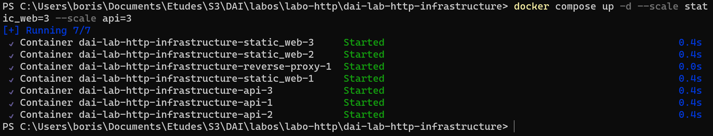
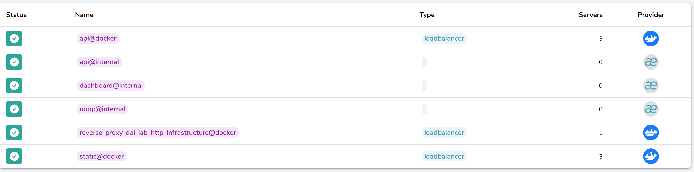

# dai-lab-http-infrastructure

## Table of contents

------------

1. [Static Website](#step-1---static-web-site)
2. [Docker Compose](#step-2---docker-compose)
3. [HTTP API server](#step-3---http-api-server)
4. [Reverse proxy with Traefik](#step-4---reverse-proxy-with-traefik)
5. [Scalability and Load Balancing](#step-5---scalability-and-load-balancing)
6. [Load balancing with round-robin and sticky sessions](#step-6---load-balancing-with-round-robin-and-sticky-sessions)
7. [Securing Traefik with HTTPS](#step-7---securing-traefik-with-https)
8. [Optional step 1](#optional-step-1)
9. [Optional step 2](#optional-step-2)

## Step 1 - Static Website

------------

Here is our Dockerfile configuration:

```dockerfile
FROM nginx:latest
COPY ./static_website /usr/share/nginx/html
COPY nginx.conf /etc/nginx/conf.d/default.conf
```

- The 1st line gets the latest nginx image
- The 2nd line copies the website's content into the nginx specific folder for html
- The last replaces the default nginx configuration file with our own.

```
server {
    listen 80;  # HTTP port

    location / {
        root /usr/share/nginx/html;  # Default Nginx HTML directory
        
        index index.html;
    }
}
```

- `listen` defines the port on which the server listens
- The block `location /` indicates 


To use the website, run the following command in the directory containing the website folder, nginx.conf file, and the dockerfile :

```
$ docker build -t webserver .
```

And then :

```
$ docker run -d -p 8080:80 webserver
```

The website will then be running on localhost:8080

## Step 2 - Docker compose

------------

We have created a file named compose.yml in the same directory as the previous files and its contents are as following :

```
services:

  static_web:
    image: webserver
    build: .
    ports:
      - "8080:80"

```

- `image` defines the image to use
- `build` build the dockerfile
- `ports` defines the ports to listen on for the local machine and the webserver

## Step 3 - HTTP API server

------------

In this step, we implemented a simple HTTP API server using Javalin, a lightweight Java web framework. Our API manages a list of farm products, and each product has details such as name, price per kilogram, organic status, origin, and an image path.

### API Endpoints

### Fetch All Products
- **Endpoint**: `/api/products`
- **Method**: GET
- **Description**: Get the details of all farm products.

### Fetch a Single Product
- **Endpoint**: `/api/products/{productId}`
- **Method**: GET
- **Description**: Get the details of a specific farm product identified by its ID.

### Fetch Image of a Product
- **Endpoint**: `/api/products/image/{productId}`
- **Method**: GET
- **Description**: Get the image of a specific farm product identified by its ID.

### Add a New Product
- **Endpoint**: `/api/products`
- **Method**: POST
- **Description**: Add a new farm product. Provide the product details in the request body.

### Update a Product
- **Endpoint**: `/api/products`
- **Method**: PUT
- **Description**: Update the details of a specific farm product identified by its ID. Provide the updated details in the request body.

### Delete a Product
- **Endpoint**: `/api/products/{productId}`
- **Method**: DELETE
- **Description**: Delete a specific farm product identified by its ID.

## Data Model
We store farm product information in memory using a `ConcurrentHashMap`. Each product is represented by the `Product` class.

## Step 4 - Reverse proxy with Traefik

------------

In order to add the traefik reverse proxy, we had to edit the [Docker compose file](compose.yml) which now looks like this :

```
services:

  static_web:
    build: ./site

    # expose replaces ports
    expose:
      - "80"
    labels:
      - "traefik.enable=true"
      - "traefik.http.routers.static.rule=Host(`localhost`)" # defining static website route

  api:
    build: ./api
    expose:
      - "7000"
    labels:
      - "traefik.enable=true"
      - "traefik.http.routers.api.rule=Host(`localhost`) && PathPrefix(`/api`)" # defining api route

  # traefik service
  reverse-proxy:
    image: traefik:v2.10
    command: --api.insecure=true --providers.docker
    ports:
      - "80:80" # port to access the static website/api
      - "8080:8080" # port to access traefik
    volumes:
      - /var/run/docker.sock:/var/run/docker.sock  

```

In this configuration:

- The `static_web` service is the static website. 
- The `api` service is for the API. 
- The `reverse-proxy` service is the Traefik reverse proxy.

The `expose` section is used instead of ports for the `static_web` and `api` services, as Traefik will access these services through the internal Docker network. `Labels` are set for Traefik to enable its features and define routing rules. This configuration allows Traefik to manage the routing of requests to the appropriate services based on the defined rules.

## Step 5 - Scalability and Load Balancing

------------

There are two ways to scale the application :

- Thanks to Traefik, directly modify the [Docker compose file](compose.yml) by adding the following lines to setup a fixed number of replicas, for example here 3:

```
#compose.yml
  static_web:
    ...
    deploy:
      replicas: 3
    ...
```

- Use the command:

```
docker-compose up -d --scale <service_name>=<number_of_instances>
```

### Check if everything is working

- With the result of the command:



- By using Traefik's Dashboard:



We can see that we have the correct number of replicas with both verifications.

## Step 6 - Load balancing with round-robin and sticky sessions

------------

Added the following lines to the docker compose file :

```
#compose.yml
  static_web:
    ...
    labels:
      ...
      - "traefik.http.services.static.loadbalancer.server.port=80"

  ...
  api:
    ...
    labels:
      ...
      - "traefik.http.services.api.loadbalancer.server.port=7000"
      - "traefik.http.services.api.loadBalancer.sticky.cookie=true" # cookie used to implement sticky session
      - "traefik.http.services.api.loadBalancer.sticky.cookie.name=stickycookie"
```

After that, the requests will get a 'Set-Cookie' header and multiple requests will all be redirected to the same container instance.

## Step 7 - Securing Traefik with HTTPS

------------

In order to enable HTTPS, we followed these steps:

1. We generated an SSL Certificate and a Key with OpenSSL, based on this [StackOverflow topic](https://stackoverflow.com/questions/10175812/how-to-generate-a-self-signed-ssl-certificate-using-openssl#10176685). We configured ourselves the different asked parameters.

```shell
openssl req -x509 -newkey rsa:4096 -keyout key.pem -out cert.pem -sha256 -days 365
```

2. We created a [Traefik Configuration File](traefik.yaml).  


3.  Mounted new files to the Traefik Container.

```yaml
#compose.yml
  reverse-proxy:
    image: traefik:v2.10
    #...
    volumes:
      - /var/run/docker.sock:/var/run/docker.sock 
      - ./ssl:/etc/traefik/certificates
      - ./traefik.yaml:/etc/traefik/traefik.yaml
```

4. Enabled TLS in static_web and api using `labels`.

```yaml
#compose.yml
    static_web:
    #...
    labels:
      #...
      - "traefik.http.routers.static.tls=true"

  api:
    #...
    labels:
    #...
    - "traefik.http.routers.api.tls=true"
```

We can now go to static website and the api by using HTTPS. The browser warns us because the certificate is self-signed, but we can ignore it.

## Optional step 1

------------

In order to add the possibility to monitor and update our Web infrastructure dynamically, we choose to add Portainer to our services:

```yaml
portainer:
    image: portainer/portainer-ce
    ports:
      - "9000:9000"
    volumes:
      - /var/run/docker.sock:/var/run/docker.sock
      - portainer_data:/data
    restart: always
    labels:
      - "traefik.enable=true"
      - "traefik.http.routers.portainer.rule=Host(`portainer.localhost`)"
      - "traefik.http.routers.portainer.entrypoints=https"
      - "traefik.http.routers.portainer.tls=true"
      - "traefik.http.routers.portainer-http.entrypoints=http"

volumes:
  portainer_data:
```

## Optional step 2

------------

For simplicity, we decided to display the products raw data in the home page. To do so, we first of all added the following js script :

```
document.addEventListener('DOMContentLoaded', function () {
    // Function to do the get request
    function fetchData() {
        fetch('https://localhost/api/products') // Get all products
            .then(response => response.json())
            .then(data => {
                // Show the results in a div with 'apiResults' as id
                document.getElementById('apiResults').innerHTML = JSON.stringify(data);
            })
            .catch(error => console.error('Error:', error));
    }
 
    // Call fetch data one the page is laoded
    fetchData();
 
    // Repeat periodically every 5 seconds
    setInterval(fetchData, 5000); 
});
```

And the following html code to index.html as the script's target :

```
<div id="apiResults"></div>
```
